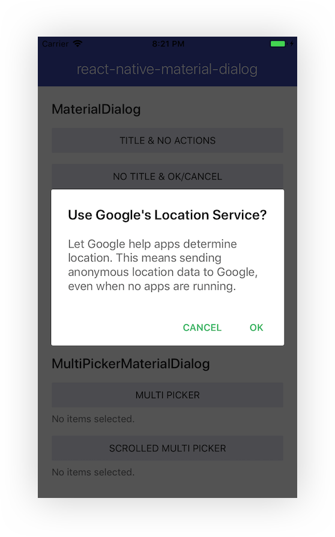
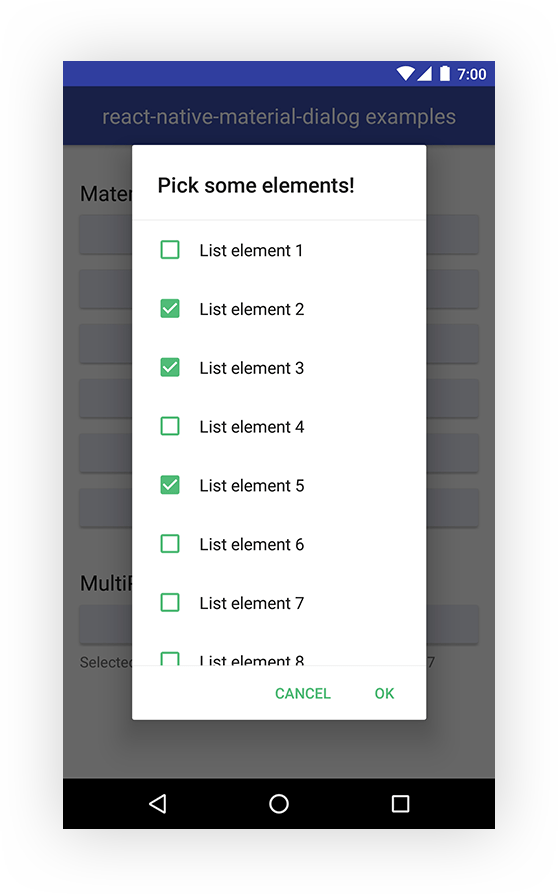
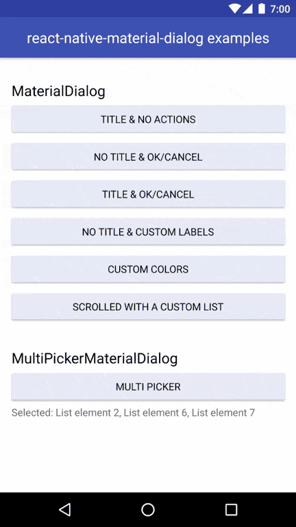
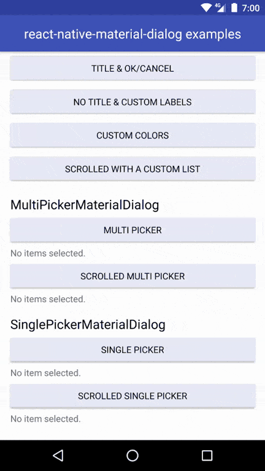
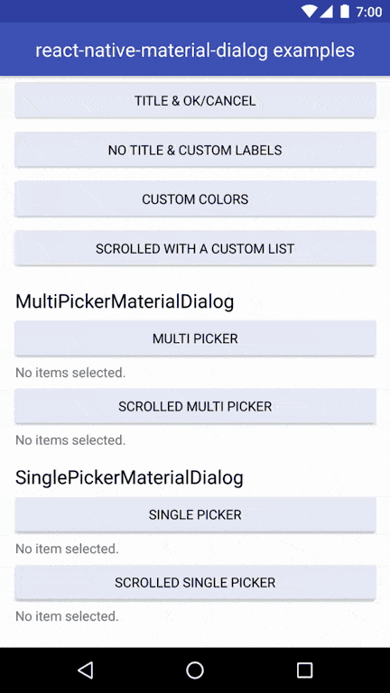

# 

[](https://www.npmjs.com/package/react-native-material-dialog)
[](https://opensource.org/licenses/MIT)
[](https://www.npmjs.com/package/react-native-material-dialog)

Material design dialog components for React Native. JavaScript-only, for iOS and
Android.

<p align="center">


</p>

## Getting started

#### Step 1

If you're not using Expo, install
[react-native-vector-icons](https://github.com/oblador/react-native-vector-icons#installation)

#### Step 2

Install react-native-material-dialog

`npm install react-native-material-dialog --save`

## Example

* Run the example app
  [via Expo](https://exp.host/@hectahertz/react-native-material-dialog-example)
  or [check the code](example/App.js).

## Included components

* [x] [MaterialDialog](https://github.com/hectahertz/react-native-material-dialog#materialdialog)
* [x] [SinglePickerMaterialDialog](https://github.com/hectahertz/react-native-material-dialog#singlepickermaterialdialog)
* [x] [MultiPickerMaterialDialog](https://github.com/hectahertz/react-native-material-dialog#multipickermaterialdialog)

## Roadmap

* [ ] Support for stacked action buttons.
* [ ] Dialog that holds a slider.
* [ ] Simple dialog component that accepts a string as content and styles it.

## MaterialDialog

Basic and customizable dialog that can hold any component.



```jsx
import { MaterialDialog } from 'react-native-material-dialog';

<MaterialDialog
  title="Use Google's Location Service?"
  visible={this.state.visible}
  onOk={() => this.setState({ visible: false })}
  onCancel={() => this.setState({ visible: false })}>
  <Text style={styles.dialogText}>
    Let Google help apps determine location. This means sending anonymous
    location data to Google, even when no apps are running.
  </Text>
</MaterialDialog>;
```

## Props

| Name            | Description                                                        | Default/Required      | Type    |
| --------------- | ------------------------------------------------------------------ | --------------------- | ------- |
| visible         | shows or hides the dialog                                          | required              | bool    |
| children        | element to be rendered in the content of the dialog                | required              | element |
| onCancel        | callback when the dialog is closed or the cancel action is pressed | required              | func    |
| onOk            | callback when the ok action is pressed                             | undefined             | func    |
| cancelLabel     | label for the cancel action                                        | 'CANCEL'              | string  |
| okLabel         | label for the ok action                                            | 'OK'                  | string  |
| title           | text for the dialog title                                          | undefined             | string  |
| titleColor      | color of the dialog title                                          | 'rgba(0, 0, 0, 0.87)' | string  |
| backgroundColor | color of the dialog background                                     | '#FFFFFF'             | string  |
| colorAccent     | color of the action text                                           | '#51BC78'             | string  |
| scrolled        | whether the form is in scrolled mode                               | false                 | bool    |
| addPadding      | automatically add paddings to the content                          | true                  | bool    |

## SinglePickerMaterialDialog

Ready to use dialog that allows to choose only one option from a list.



```jsx
import { SinglePickerMaterialDialog } from 'react-native-material-dialog';

<SinglePickerMaterialDialog
  title={'Pick one element!'}
  items={LIST.map((row, index) => ({ value: index, label: row }))}
  visible={this.state.singlePickerVisible}
  selectedItem={this.state.singlePickerSelectedItem}
  onCancel={() => this.setState({ singlePickerVisible: false })}
  onOk={result => {
    this.setState({ singlePickerVisible: false });
    this.setState({ singlePickerSelectedItem: result.selectedItem });
  }}
/>;
```

## Props

| Name            | Description                                                        | Default/Required      | Type                                                 |
| --------------- | ------------------------------------------------------------------ | --------------------- | ---------------------------------------------------- |
| visible         | shows or hides the dialog                                          | required              | bool                                                 |
| items           | list of options to choose from                                     | required              | array of objects with a 'label' and 'value' property |
| selectedItem    | item that will be selected when opening the dialog                 | required              | object with a 'label' and 'value' property           |
| onCancel        | callback when the dialog is closed or the cancel action is pressed | required              | func                                                 |
| onOk            | callback when the ok action is pressed                             | undefined             | func                                                 |
| cancelLabel     | label for the cancel action                                        | 'CANCEL'              | string                                               |
| okLabel         | label for the ok action                                            | 'OK'                  | string                                               |
| title           | text for the dialog title                                          | undefined             | string                                               |
| titleColor      | color of the dialog title                                          | 'rgba(0, 0, 0, 0.87)' | string                                               |
| backgroundColor | color of the dialog background                                     | '#FFFFFF'             | string                                               |
| colorAccent     | color of the action text                                           | '#51BC78'             | string                                               |
| scrolled        | whether the form is in scrolled mode                               | false                 | bool                                                 |

## MultiPickerMaterialDialog

Ready to use dialog that allows to choose several options from a list.



```jsx
import { MultiPickerMaterialDialog } from 'react-native-material-dialog';

<MultiPickerMaterialDialog
  title={'Pick some elements!'}
  colorAccent={this.props.colorAccent}
  items={LIST.map((row, index) => {
    return { value: index, label: row };
  })}
  visible={this.state.multiPickerVisible}
  selectedItems={this.state.multiPickerSelectedItems}
  onCancel={() => this.setState({ multiPickerVisible: false })}
  onOk={result => {
    this.setState({ multiPickerVisible: false });
    this.setState({ multiPickerSelectedItems: result.selectedItems });
  }}
/>;
```

## Props

| Name            | Description                                                        | Default/Required      | Type                                                 |
| --------------- | ------------------------------------------------------------------ | --------------------- | ---------------------------------------------------- |
| visible         | shows or hides the dialog                                          | required              | bool                                                 |
| items           | list of options to choose from                                     | required              | array of objects with a 'label' and 'value' property |
| selectedItems   | items that will be selected when opening the dialog                | required              | array of objects with a 'label' and 'value' property |
| onCancel        | callback when the dialog is closed or the cancel action is pressed | required              | func                                                 |
| onOk            | callback when the ok action is pressed                             | undefined             | func                                                 |
| cancelLabel     | label for the cancel action                                        | 'CANCEL'              | string                                               |
| okLabel         | label for the ok action                                            | 'OK'                  | string                                               |
| title           | text for the dialog title                                          | undefined             | string                                               |
| titleColor      | color of the dialog title                                          | 'rgba(0, 0, 0, 0.87)' | string                                               |
| backgroundColor | color of the dialog background                                     | '#FFFFFF'             | string                                               |
| colorAccent     | color of the action text                                           | '#51BC78'             | string                                               |
| scrolled        | whether the form is in scrolled mode                               | false                 | bool                                                 |

## References

* https://material.io/guidelines/components/dialogs.html

## License

* [MIT](LICENSE)

## Contact

[Tweet me @hectahertz](https://twitter.com/hectahertz)
